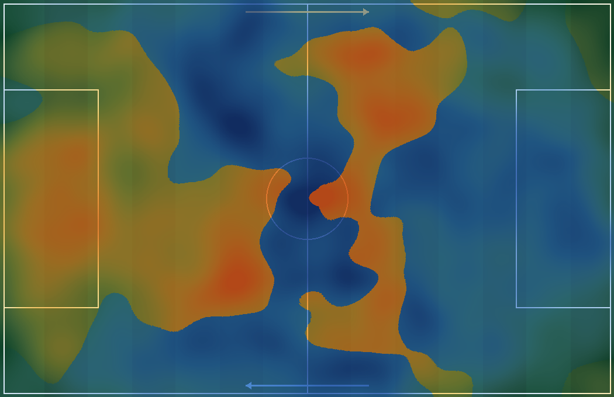

<div align="center">


# Foot Game Theory

**Moneyball da Copa 2026 — Brasil × Japão, decidido nos dados.**

Um dossiê tático-estatístico que junta modelo de probabilidade, mapas de calor de
território e a alma da crônica. Por [**Arvor Intelligence**](https://arvor.co).

[](https://github.com/ArvorCo/footgametheory/actions/workflows/ci.yml)

[](LICENSE)


[**🌐 Site ao vivo**](https://footgametheory.arvor.co/) ·
[Laudo](https://footgametheory.arvor.co/brasil-japao-moneyball.html) ·
[Ranking](https://footgametheory.arvor.co/ranking.html)



</div>

---

## O que é

A partir dos dados da fase de grupos (3 jogos de cada seleção), o projeto produz
três artefatos, todos gerados por um único pipeline reprodutível:

| Página | O que é |
|--------|---------|
| 🏠 [`index.html`](docs/index.html) | Hero de marketing com os três caminhos de leitura |
| 📋 [`brasil-japao-moneyball.html`](docs/brasil-japao-moneyball.html) | **O Laudo** — relatório premium com infográficos, heatmaps anotados, radares, os 11 mapa a mapa, plano de jogo e veredito |
| 🏅 [`ranking.html`](docs/ranking.html) | **O Ranking** — jogadores por FGT Index, filtrável e ordenável |
| 🧵 [`brasil-japao-thread.html`](docs/brasil-japao-thread.html) | **A Thread** — 25 cards 16:9 prontos para o X, com os duelos individuais Brasil × Japão no mesmo campo |

## Como rodar

```bash
pip install -r requirements.txt
python3 scripts/build_report.py
```

Regenera o banco (`build/`), os CSVs (`analysis/`) e todo o site (`docs/`). Para
ver localmente: `cd docs && python3 -m http.server` e abra <http://localhost:8000>.

## Os modelos

- **FGT Index** — score 0–100 por função, percentil com *shrinkage* por minutos:
  `score · min/(min+90) + 50 · 90/(min+90)`.
- **Placar (Poisson)** — distribuição exata; λ de cada seleção = média geométrica do
  próprio ataque (xG/jogo) e da fragilidade defensiva do adversário (xGOT sofrido/jogo).
- **Eficiência de finalização** — gols − xG (quem é clínico).
- **Radares** — perfil de 6 eixos por jogador. **Mismatches de corredor** e **grids de zona 3×3**.
- **Clusters de papel** (KMeans) → substitutos por arquétipo, mesma posição.
- **Heatmaps compostos** por time/setor e **mapas de duelo** (jogador × oponente, no mesmo campo,
  com o adversário girado 180° para o confronto), coloridos por time (Brasil quente, Japão azul).

## Estrutura

```
scripts/
  build_report.py     orquestrador (extrai, normaliza, agrega, gera tudo)
  models.py           Poisson, eficiência, radares, mismatches, zonas, clusters, dossiês
  heatmap_compose.py  heatmaps compostos, individuais, de duelo e de confronto (Pillow)
  charts_svg.py       gráficos SVG inline (radar, Poisson, xG-race, zonas, formação)
  report_html.py      gera o laudo        thread_html.py  gera a thread
  ranking_html.py     gera o ranking      home_html.py    gera a home
  cronista.py         carrega a prosa (analysis/copy_*.json)
data/16avos/          fonte bruta (imutável)
analysis/             CSVs derivados + textos da crônica (JSON)
docs/                 site publicável (GitHub Pages)
```

## Publicar (GitHub Pages)

Settings → Pages → Source: `main` / pasta `/docs`. O site sai em
`https://footgametheory.arvor.co/` (domínio em `docs/CNAME`). O `.nojekyll` já está incluído.

## Qualidade

Política **zero-lint**, validada no CI a cada push:

```bash
ruff check scripts/ && black --check scripts/ && isort --check scripts/
```

Veja [CONTRIBUTING.md](CONTRIBUTING.md) para detalhes.

## Dados & isenção

As estatísticas e heatmaps em `data/` derivam de páginas públicas de partidas e
são usados aqui para fins **educacionais e de pesquisa**; os direitos sobre os
dados pertencem aos seus donos. Projeto **sem afiliação** com FIFA, FotMob, clubes
ou federações. Código sob [MIT](LICENSE).

## Limitações honestas

Não há dados de evento (x,y por lance). Defesa é estimada pelo goleiro; os mapas
de confronto/duelo cruzam jogos diferentes — são **tendências estilizadas**, não
posicionamento de uma partida real. Com um feed de eventos, dá para fazer o
head-to-head posicional exato.

---

<div align="center">

**[Arvor Intelligence](https://arvor.co)** — inteligência que vira decisão.

</div>
